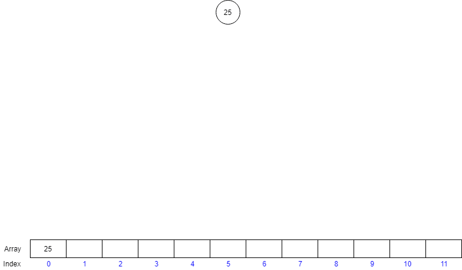
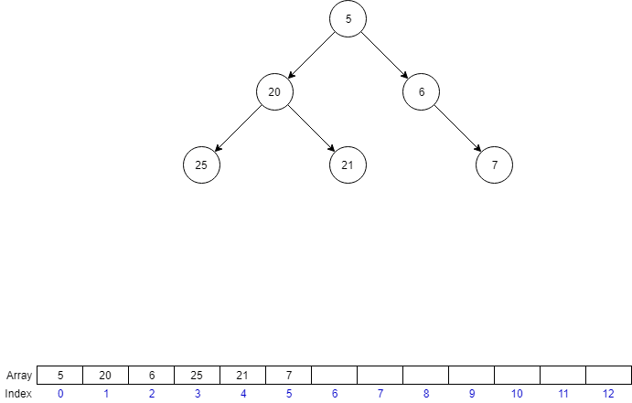

# HALDA #

Naprogramujte datovou strukturu Halda (Min-Heap).

Programujeme **Min-Heap** tudíž první prvek je vždy nejmenší z celé datové struktury. Pro Min-Heap platí jednoduché pravidlo, řekněme, že máme index 'Q' pro prvky na indexu '**Q * 2**' a 
'**Q * 2 + 1**' (následníci) vždy platí, že jsou větší než prvek na samotném indexu '**Q**'(předchůdce)

Konečná halda může vypadat následovně:
***
|   Prvky    | 5 | 6 | 20 | 25 | 7 | 21 | 22 | 26 | 27 |
|------------|---|---|----|----|---|----|----|----|----|
|Index v poli| 0 | 1 | 2  | 3  | 4 | 5  | 6  | 7  | 8  |
***

Jelikož začínáme na nultém prvku, tak pokud si chceme toto pravidlo zkontrolovat, musíme k indexu připočíst 1 (V kódu však nemusíme).

Např. prvek na indexu 3 (20) musí být menší jak prvky na indexu 6 (21) a 7 (22).

**Příklad vkládání do haldy:**



**Příklad mazání nejmenšího prvku v haldě:**



Ve svém programu můžete využít funkci Heap_Print, která vypíše samotný prvek s jeho indexem, tak i jeho potomky.

*  Program musí být univerzální a být schopen pojmout libovolné množství záznamů.
*  Počáteční maximální počet položek v haldě je 4
*  Pokud halda překročí maximální počet položek, zdvojnásobíme její velikost

**Poznámky:**

Nezapomeňte na dynamicky alokovanou paměť, pro kterou poslouží knihovna 'mymalloc.h'

Pro porovnávání dvou prvků využijte funkce 'Data_Cmp' z knihovny 'data.h'


Následuje krátký popis funkcí, které potřebujeme ke správné funkci naší haldy (podrobnější popis můžete najít v hlavičkovém souboru 'heap.h'). 


### V jazyce C implementujte následující funkce:

**Heap_Init** - Inicializuje haldu

**Heap_Insert** - Vloží prvek na poslední místo a pokud jeho předchůdce je větší, prohodíme tyto 2 prvky a tento krok provádíme, 
dokud náš prvek není větší než předchůdce a nebo se náš prvek nedostane na první pozici

**Heap_Destruct** - Uvolní naalokovanou paměť. Nastaví jednotlivé položky haldy na nulové hodnoty. 
    
**Heap_FindMin** - Navrátí nejmenší prvek, který se v datové struktuře nachází

**Heap_DeleteMin** - Odebere nejmenší prvek z haldy. Prvek z poslední pozice přesuneme na první pozici
avšak místo s předchůdci ho porovnáme s jeho následovníky, a prohazujeme opět dokud následnovníci nebudou větší než náš prvek

**Heap_Empty** - Tato funkce nám sdělí jestli je naše halda prázdná či obsahuje nějaký prvek

**Heap_Count** - Funkce, která nám sdělí kolik prvků se právě nachází v haldě.

**Heap_Swap** - Funkce na prohození dvou prvků v haldě, využívá se u mazání a vkládání nových prvků do haldy. 


# HEAP #

The task is Min-Heap -> The first element (index 0) is always the smallest from the whole data structure. Min-Heap has a simple rule, lets say we have index 'Q',
the element on the index '**Q * 2**' and '**Q * 2 + 1**' (childrens) are **always bigger** that the item itself on position '**Q**' (father).

The final Min-Heap could look like this : 

***
|     Items    | 5 | 6 | 20 | 25 | 7 | 21 | 22 | 26 | 27 |
|--------------|---|---|----|----|---|----|----|----|----|
|Index in array| 0 | 1 | 2  | 3  | 4 | 5  | 6  | 7  | 8  |
***

Since we're starting at index 0, for easier check let's say that index 0 is index 1 just for now, the item on index 3 (20) has to be always smaller that the items on the index 6 (21) and 7 (22).

**Example of inserting item in heap:**


**Example of deleting an item with the lowest value:**


In your program you can easily print your heap using Heap_Print, which will print the item itself and his childrens. 

*  Program has to be universal and be able to store any amount of items
*  The starting maximum number of items in heap is 4
*  If the heap reaches its maximum number of items, double its size

**Notes:**

For allocating memory don't forget to use the functions from library 'mymalloc.h'

For comparing items use the function 'Data_Cmp' from library 'data.h'


A brief description of functions, that we need for our heap to work properly (More detailed description can be found in header file 'heap.h').

### In C language implement those functions:

**Heap_Init** - Initializes the heap

**Heap_Insert** - Inserts the item at the end of heap and if the father item is bigger, we switch those items,
this happens until our item isn't bigger than his father item or the item get's to the first position.

**Heap_Destruct** - Releases the allocated memory. Sets each heap item to zero.

**Heap_FindMin** - Returns the smallest item in the heap.

**Heap_DeleteMin** - Deletes and returns the smallest item in heap. The item that is at the end of the heap we move to the first place,
then we compare it with his childrens and swap them until the rules are met.

**Heap_Empty** - Returns if our heap is empty or if there's an item.

**Heap_Count** - Returns the amount of items stored in heap.

**Heap_Swap** - Swaps two items in heap - used for inserting and deleting of items in heap. 

### Ukázka běhu programu/Example of program: ###

```
Heap v1.0
----------

0: Init,
1: Insert,
2: HeapPrint,
3: HeapDeleteMin
4: HeapFindMin
M: Menu
E: END
0
Your choice: 0 - Init

Initializing heap!

Type char 0-A, E=END, M=MENU:
************************************************************
1
Your choice: 1 - Insert

Please, enter the following data:

Please, enter a name: Peter
Enter age, weight and height (separated by Enter):
20
167
209
myMalloc: allocating 280 bytes, total allocated 280 bytes

Type char 0-A, E=END, M=MENU:
************************************************************
4
Your choice: 4 - HeapFindMin

The lowest item in heap is: Name=Peter, age=20.0, weight=167.0, height=209.0

Type char 0-A, E=END, M=MENU:
************************************************************
1
Your choice: 1 - Insert

Please, enter the following data:

Please, enter a name: Anna
Enter age, weight and height (separated by Enter):
19
47
167
myRealloc: allocating 280 bytes, total allocated 560 bytes

Type char 0-A, E=END, M=MENU:
************************************************************
4
Your choice: 4 - HeapFindMin

The lowest item in heap is: Name=Anna, age=19.0, weight=47.0, height=167.0

Type char 0-A, E=END, M=MENU:
************************************************************
1
Your choice: 1 - Insert

Please, enter the following data:

Please, enter a name: Xavier
Enter age, weight and height (separated by Enter):
34
76
189
myRealloc: allocating 280 bytes, total allocated 840 bytes

Type char 0-A, E=END, M=MENU:
************************************************************
2
Your choice: 2 - HeapPrint


Index 1(0) - Name=Anna, age=19.0, weight=47.0, height=167.0
 |  Child index 2(1) - Name=Peter, age=20.0, weight=167.0, height=209.0
 |  Child index 3(2) - Name=Xavier, age=34.0, weight=76.0, height=189.0

Index 2(1) - Name=Peter, age=20.0, weight=167.0, height=209.0

Index 3(2) - Name=Xavier, age=34.0, weight=76.0, height=189.0

Type char 0-A, E=END, M=MENU:
************************************************************
1
Your choice: 1 - Insert

Please, enter the following data:

Please, enter a name: Aatrox
Enter age, weight and height (separated by Enter):
34
87
190
myRealloc: allocating 280 bytes, total allocated 1120 bytes

Type char 0-A, E=END, M=MENU:
************************************************************
2
Your choice: 2 - HeapPrint


Index 1(0) - Name=Aatrox, age=34.0, weight=87.0, height=190.0
 |  Child index 2(1) - Name=Anna, age=19.0, weight=47.0, height=167.0
 |  Child index 3(2) - Name=Xavier, age=34.0, weight=76.0, height=189.0

Index 2(1) - Name=Anna, age=19.0, weight=47.0, height=167.0
 |  Child index 4(3) - Name=Peter, age=20.0, weight=167.0, height=209.0

Index 3(2) - Name=Xavier, age=34.0, weight=76.0, height=189.0

Index 4(3) - Name=Peter, age=20.0, weight=167.0, height=209.0

Type char 0-A, E=END, M=MENU:
************************************************************
3
Your choice: 3 - HeapDeleteMin

myRealloc: releasing 280 bytes, total allocated 840 bytes
Item that was deleted: Name=Aatrox, age=34.0, weight=87.0, height=190.0

Type char 0-A, E=END, M=MENU:
************************************************************
3
Your choice: 3 - HeapDeleteMin

myRealloc: releasing 280 bytes, total allocated 560 bytes
Item that was deleted: Name=Anna, age=19.0, weight=47.0, height=167.0

Type char 0-A, E=END, M=MENU:
************************************************************
4
Your choice: 4 - HeapFindMin

The lowest item in heap is: Name=Peter, age=20.0, weight=167.0, height=209.0

Type char 0-A, E=END, M=MENU:
************************************************************
3
Your choice: 3 - HeapDeleteMin

myRealloc: releasing 280 bytes, total allocated 280 bytes
Item that was deleted: Name=Peter, age=20.0, weight=167.0, height=209.0

Type char 0-A, E=END, M=MENU:
************************************************************
3
Your choice: 3 - HeapDeleteMin

myFree: releasing 280 bytes, total allocated 0 bytes
Item that was deleted: Name=Xavier, age=34.0, weight=76.0, height=189.0

Type char 0-A, E=END, M=MENU:
************************************************************
E

Type char 0-A, E=END, M=MENU:
************************************************************

```